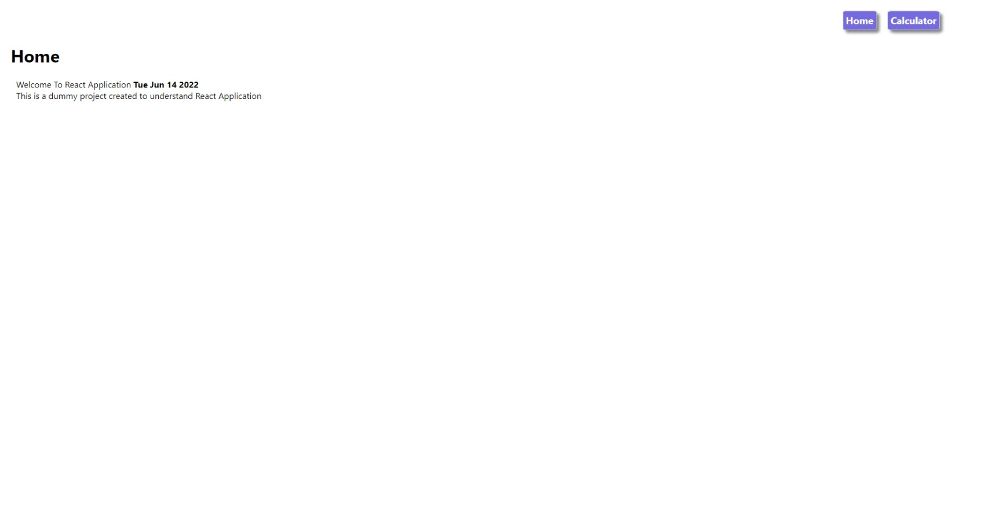
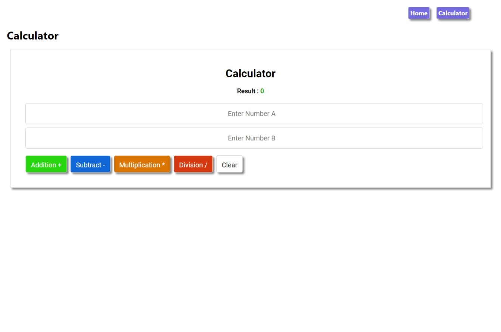

# Router Demo

[👈 Go Back ](./../Readme.md)

**Note📓:** **_This project was bootstrapped with [Create React App](https://github.com/facebook/create-react-app)._**

This Project is a demo project for the [Day-01-Self-Practice](./README.md) a part of [React Internship](../../Readme.md). This Project reveals a uncase of react router, components, State several basic usage.

## Table of Content

- [Router Demo](#router-demo)
  - [Table of Content](#table-of-content)
  - [Screenshots](#screenshots)
    - [Home Page](#home-page)
    - [Calculator Page](#calculator-page)

## Screenshots

Screenshots of application are shown below.

### Home Page

Home Page

### Calculator Page

Calculator Page

