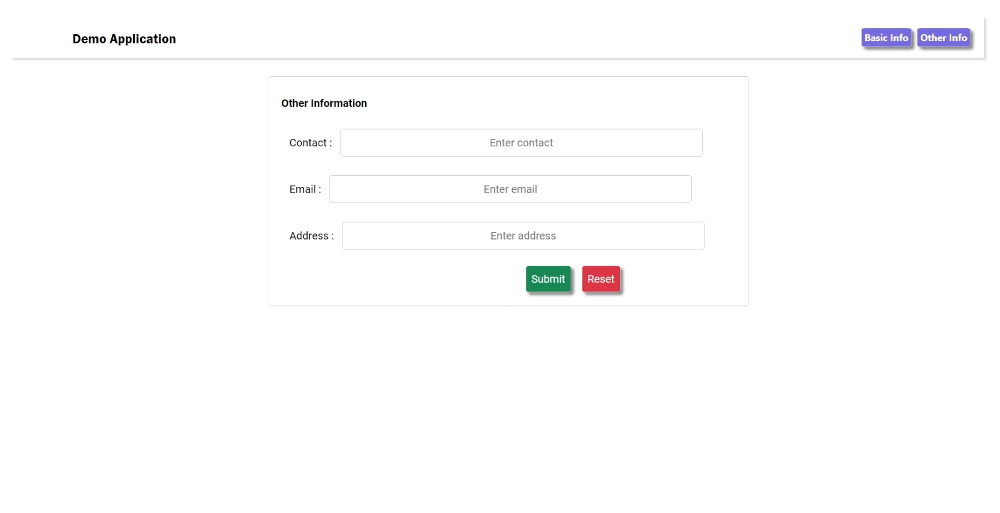

# Demo Application

[👈 Go Back ](./../Readme.md)

**Note📓:** **_This project was bootstrapped with [Create React App](https://github.com/facebook/create-react-app)._**

This Project is a demo project for the [Day-01-Task](./README.md) a part of [React Internship](../../Readme.md). This Project reveals a uncase of react router, components, State several basic usage.

## Table of Content

- [Demo Application](#demo-application)
  - [Table of Content](#table-of-content)
  - [Screenshots](#screenshots)
    - [Basic Info](#basic-info)
    - [Other Info](#other-info)

## Screenshots

Screenshots of application are shown below.

### Basic Info

Unfilled Form.

Filled Form.

### Other Info

Unfilled Form.

Filled Form.

