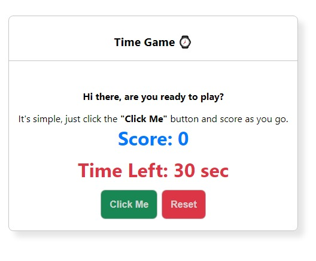
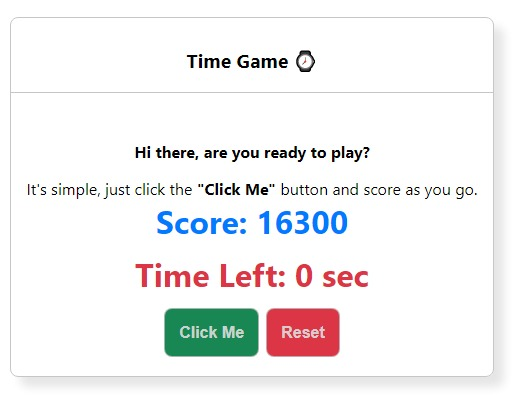

# Time Game

[👈 Go Back ](../Readme.md)

**Note📓:** **_This project was bootstrapped with [Create React App](https://github.com/facebook/create-react-app)._**

This Project is a timer game for the [Day-03-Self-Practice](./README.md) a part of [React Internship](../../Readme.md). This Project reveals a uncase of useEffect hook, components, State along with timeout function.

## Table of Content

- [Time Game](#time-game)
  - [Table of Content](#table-of-content)
  - [Screenshots](#screenshots)

## Screenshots

Screenshots of application are shown below.

Initial Screenshot of Time Game

After time stops.

