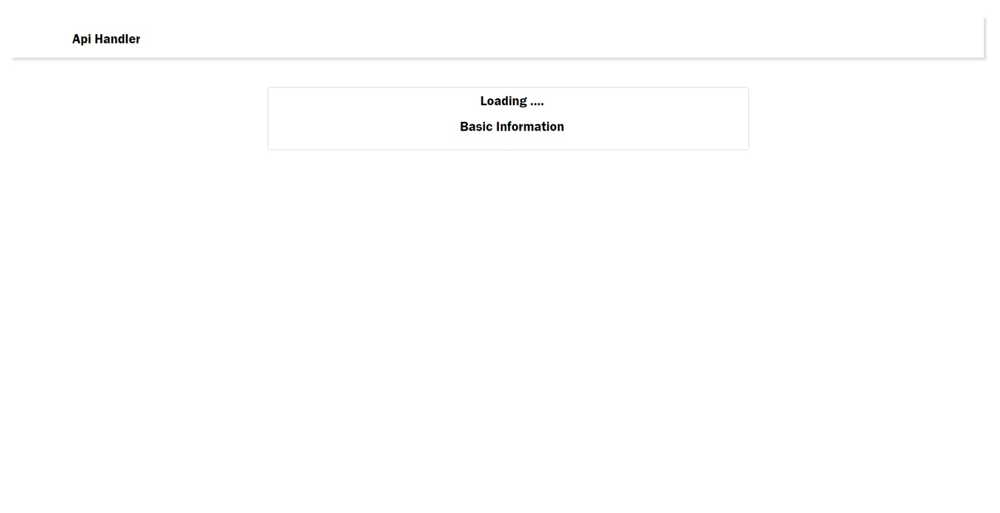
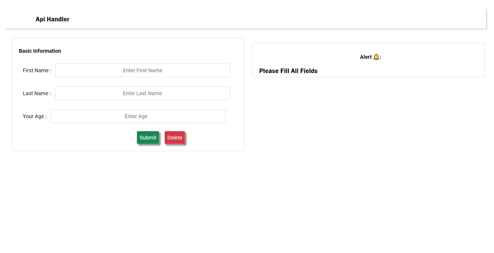
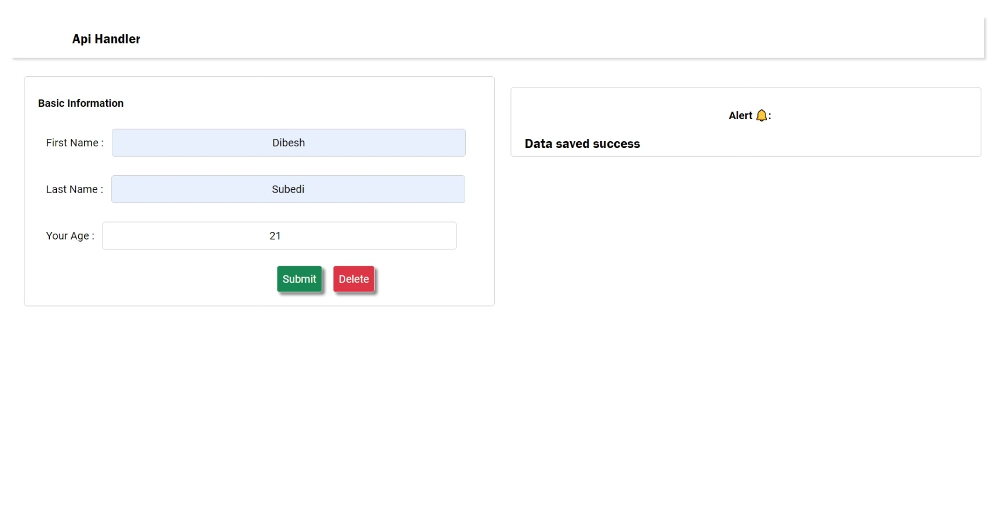

# Api Handler

[👈 Go Back](./../Readme.md)

**Note📓:** **_This project was bootstrapped with [Create React App](https://github.com/facebook/create-react-app)._**

This Project is a demo project for the [Day-04-Task](./README.md) a part of [React Internship](../../Readme.md). This Project reveals a uncase of components, hooks (useState, useEffects), props and a mocked api.

## Table of Content

- [Api Handler](#api-handler)
  - [Table of Content](#table-of-content)
  - [Screenshots](#screenshots)
    - [Basic Info](#basic-info)

## Screenshots

Screenshots of application are shown below.

### Basic Info

Loading

Empty Form.

Empty Submit.

Saved

Delete

