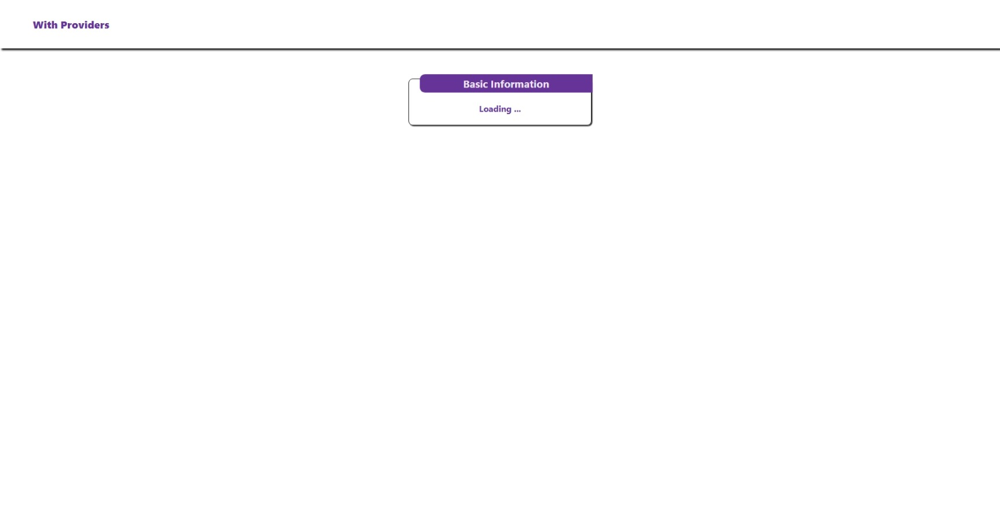
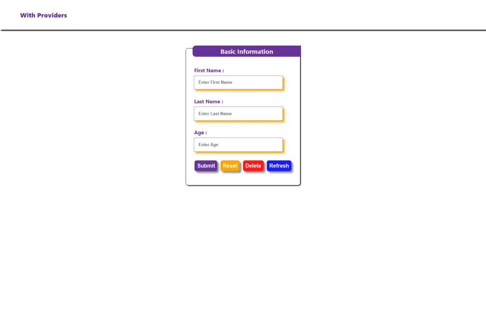
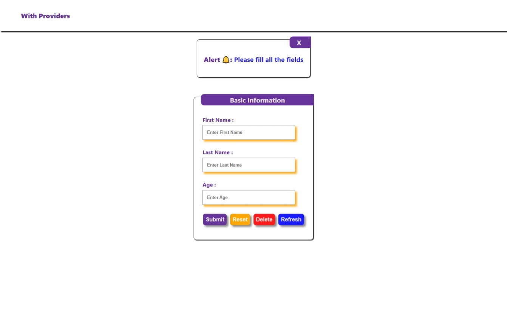
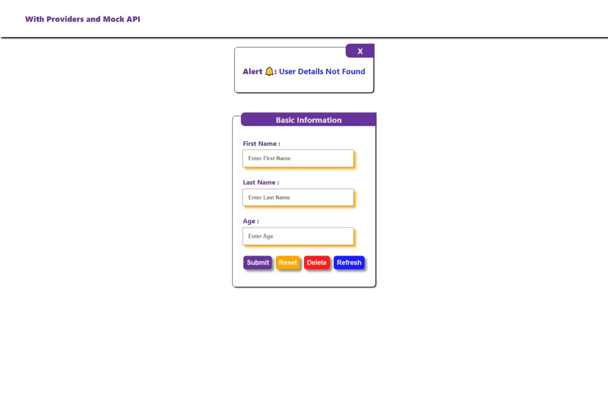
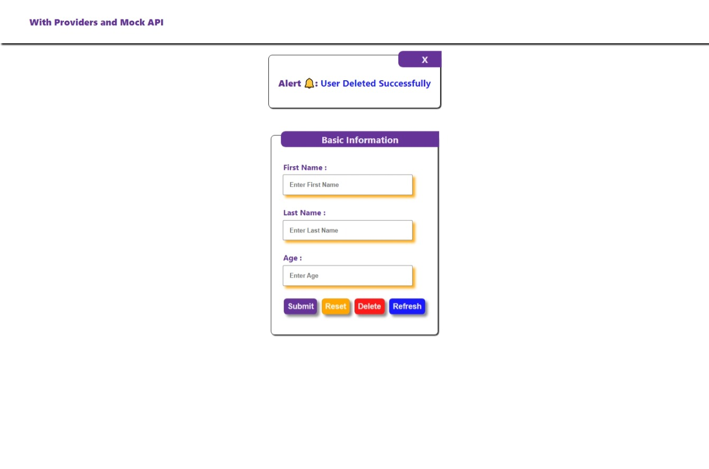
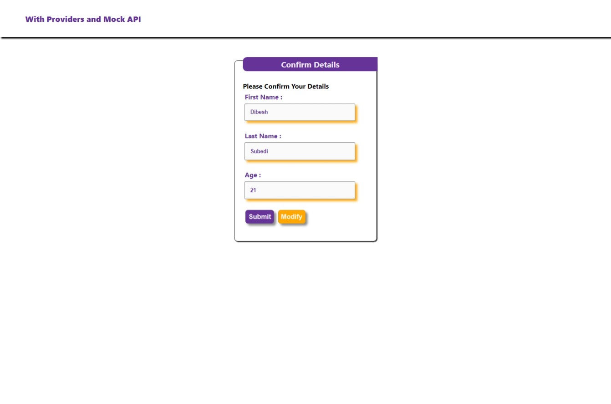

# All Concept merged

[👈 Go Back](./../Readme.md)

**Note📓:** **_This project was bootstrapped with [Create React App](https://github.com/facebook/create-react-app)._**

This Project is a demo project for the [Day-06-Self-Practice](./README.md) a part of [React Internship](../../Readme.md). This Project reveals a uncase of components, hooks (useState, useEffects, useNavigate, createContext, useContext), props. It also reveals a way to pass data between components using Providers along with mock API of [📂 Task-4](../Day-04-Task/README.md).

## Table of Content

- [All Concept merged](#all-concept-merged)
  - [Table of Content](#table-of-content)
  - [Screenshots](#screenshots)
    - [Homepage](#homepage)
    - [Confirmation Page](#confirmation-page)
  - [Explanation](#explanation)

## Screenshots

Screenshots of application are shown below.

### Homepage

Loading Form.

After Loading

Details Not fount on Submit

Added Success

Details Not fount on Delete

Delete Success

### Confirmation Page

## Explanation

When application lodes a form is shown and when details is filled and submitted it redirects to another page with the given information. when reset button in confirmation page is clicked it redirects to homepage resetting the details passed.  
